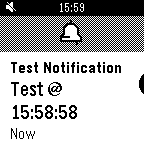
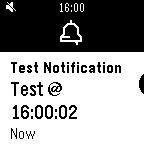

# PebbleOS Settings

This is a combination of my personal settings and some notes on how they work.

NOTE with the RePebble Pebble app watch settings can be controlled via the phone app (version 1.0.9.12).

## Pebble Settings

### PebbleOS Device Settings

#### Notifications

Filter: Allow All Notifications

Text Size: Default / Larger

Timeout: 3 minutes  # NOTE this is ignored when Quiet Time is on! https://www.reddit.com/r/pebble/comments/1pbv94r/comment/nrtcw7w/?utm_source=share&utm_medium=web3x&utm_name=web3xcss&utm_term=1&utm_content=share_button

Banner Style (PebbleOS 4.9+): Classic (Flat Black)

Screenshots showing differences:

 

Vibe Timming (PebbleOS 4.9.100+): Beginning (End)

#### Vibrations

Notifications: Jackhammer

Incoming Calls: Standard - High

Alarms: Reveille

System: Standard - High

#### Quiet Time

Manual: Off

Calendar Aware: Disabled

Weekdays: 0:00 - 6:00

Weekends: 0:00 - 6:00

Interuptions: Quiet All Notifications

#### Timeline

Quickview: On

Timing: 10 Min Before

#### Quick Launch

Clay Authenticator
Notifications
Bobby
Quiet Time

#### Date and Time

Time Format: 24h

Timezone Source: Automatic

Timezone: America/Los_Angeles

#### Display

Language: English

Orientation: Default (right-handed) or Left-Handed. I troduced in FW v4. 9.121

Backlight: On

Motion Enabled: On

Ambient Sensor: On

Intensity: High

depends on watch

Timeout: 3 seconds

#### Background App

Usually None.
Battery+ and Battery- are decent options.

#### System

  * Information
  * Certification
  * Stand-By-Mode: Defaults to Off

    Power save feature. If enabled,

    If you enable stand-by mode and take the watch off and leave it on the table,
    the watch will enable airplane mode after half an hour without movement and
    re-enable Bluetooth if you pick it up again.

    https://www.reddit.com/r/pebble/s/5d1VwYqIEW

  * Debugging (PebbleOS 4.9+) - Boolean
  * Shut Down
  * Factory Reset
